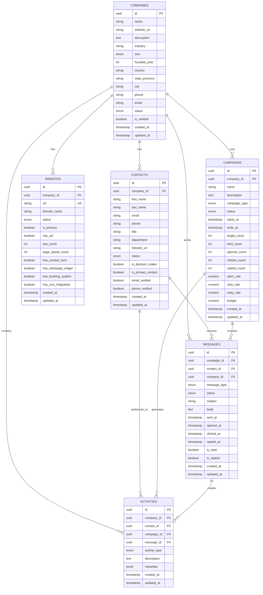

# LeadEngine Phase 1 - Entity Relationship Diagram

## ER Diagram



## Database Schema Overview

### Core Entity: Companies
The central entity representing business prospects and leads.

**Key Fields:**
- `id` (UUID) - Primary key
- `name` - Company name
- `website_url` - Primary website
- `industry` - Business industry
- `size` - Company size classification
- `status` - Current prospect status
- `is_verified` - Manual verification flag
- `created_at`, `updated_at` - Timestamps

**Relationships:**
- One company has many contacts
- One company has many websites
- One company runs many campaigns
- One company contains many activities
- One company sends many messages

---

### Contacts
Individual decision-makers and employees within companies.

**Key Fields:**
- `id` (UUID) - Primary key
- `company_id` (FK) - Reference to company
- `first_name`, `last_name` - Contact name
- `email`, `phone` - Contact methods
- `title`, `department` - Job information
- `is_decision_maker` - Decision authority flag
- `is_primary_contact` - Primary contact flag
- `status` - Engagement status
- `email_verified`, `phone_verified` - Validation flags

**Relationships:**
- Many contacts belong to one company
- One contact receives many messages
- One contact has many activities

**Constraints:**
- Email or phone must be present
- Foreign key to companies (cascade delete)

---

### Websites
Website information and technical audit data.

**Key Fields:**
- `id` (UUID) - Primary key
- `company_id` (FK) - Reference to company
- `url` (Unique) - Website URL
- `domain_name` - Extracted domain
- `status` - Audit status
- `has_ssl` - SSL certificate check
- `seo_score` - SEO quality score (0-100)
- `page_speed_score` - Performance score (0-100)
- `has_contact_form` - Feature detection
- `has_whatsapp_widget` - WhatsApp integration
- `has_booking_system` - Booking capabilities
- `has_crm_integration` - CRM integration check

**Relationships:**
- Many websites belong to one company

**Constraints:**
- Unique URL per entry
- Score ranges validated (0-100)
- Foreign key to companies (cascade delete)

---

### Campaigns
Marketing and outreach campaign definitions.

**Key Fields:**
- `id` (UUID) - Primary key
- `company_id` (FK) - Reference to company
- `name` - Campaign name
- `campaign_type` - Type (cold_email, proposal, follow_up, etc.)
- `status` - Campaign status (draft, active, paused, completed)
- `starts_at`, `ends_at` - Campaign timeline
- `target_count` - Number of targets
- `sent_count`, `opened_count`, `clicked_count`, `replied_count` - Metrics
- `open_rate`, `click_rate`, `reply_rate` - Calculated percentages
- `budget`, `spent` - Budget tracking

**Relationships:**
- One company runs many campaigns
- Many campaigns include many messages
- One campaign generates many activities

**Constraints:**
- Campaign name required
- Start date before end date
- Rate ranges validated (0-100)
- Foreign key to companies (cascade delete)

---

### Messages
Communication records (emails, SMS, WhatsApp, etc.).

**Key Fields:**
- `id` (UUID) - Primary key
- `campaign_id` (FK) - Optional campaign reference
- `contact_id` (FK) - Reference to recipient
- `company_id` (FK) - Reference to company
- `message_type` - Type (email, sms, whatsapp, linkedin)
- `status` - Delivery status (draft, scheduled, sent, delivered, failed)
- `subject`, `body` - Message content
- `scheduled_for` - Scheduled send time
- `sent_at`, `delivered_at`, `opened_at`, `clicked_at`, `replied_at` - Timestamps
- `is_read`, `is_replied` - Engagement flags
- `retry_count`, `last_retry_at` - Failure retry tracking
- `error_message` - Last error if failed

**Relationships:**
- Many messages belong to one contact
- Many messages belong to one company
- Many messages belong to one campaign (optional)
- One message creates activities

**Constraints:**
- Body required and non-empty
- Contact or company must exist
- Foreign keys with cascade/set null behavior

**Indexes:**
- By campaign (for campaign reporting)
- By contact (for contact history)
- By status (for delivery tracking)
- By scheduled_for (for send queue)
- By created_at (for sorting)

---

### Activities
Audit trail for all events and interactions.

**Key Fields:**
- `id` (UUID) - Primary key
- `company_id` (FK) - Reference to company
- `contact_id` (FK) - Optional contact reference
- `campaign_id` (FK) - Optional campaign reference
- `message_id` (FK) - Optional message reference
- `activity_type` - Type of activity (email_sent, opened, clicked, call_made, etc.)
- `description` - Human-readable description
- `metadata` - Flexible JSONB for additional data
- `created_at` - When activity occurred

**Activity Types:**
- `email_sent` - Email message sent
- `email_opened` - Email opened by recipient
- `link_clicked` - Link in email clicked
- `call_made` - Phone call made
- `meeting_scheduled` - Meeting scheduled
- `proposal_sent` - Proposal sent
- `proposal_signed` - Proposal signed
- `note_added` - Manual note added
- `contact_enriched` - Contact data enriched
- `website_crawled` - Website crawled
- `lead_scored` - Lead score calculated
- `audit_completed` - Website audit completed

**Relationships:**
- Many activities belong to one company
- One activity may reference a contact
- One activity may reference a campaign
- One activity may reference a message

**Constraints:**
- Company required
- Optional foreign keys to other entities
- Foreign keys with set null on cascade

---

## Data Flow

### Lead Discovery to Outreach Flow

```
1. Company Created (activity: company_imported)
   ↓
2. Website Added & Crawled (activity: website_crawled)
   ↓
3. Contacts Enriched (activity: contact_enriched)
   ↓
4. Lead Scored (activity: lead_scored)
   ↓
5. Campaign Created (campaign: draft)
   ↓
6. Messages Drafted (message: draft)
   ↓
7. Messages Sent (message: sent, activity: email_sent)
   ↓
8. Engagement Tracked (activity: email_opened, link_clicked)
   ↓
9. Follow-ups Scheduled (message: scheduled)
   ↓
10. Responses Tracked (activity: email_replied)
```

---

## Indexes Summary

### Performance Optimization

**Full-Text Search Indexes:**
- `companies.name` - GIN index with trigram for fuzzy search
- `contacts.name` - GIN index for name search

**Foreign Key Indexes:**
- `contacts.company_id`
- `websites.company_id`
- `campaigns.company_id`
- `messages.campaign_id`
- `messages.contact_id`
- `messages.company_id`
- `activities.company_id`
- `activities.contact_id`
- `activities.campaign_id`
- `activities.message_id`

**Status Indexes:**
- `companies.status` - Filter by prospect status
- `contacts.status` - Filter by engagement
- `websites.status` - Filter by audit status
- `campaigns.status` - Filter active/paused
- `messages.status` - Filter delivery status

**Timestamp Indexes:**
- `companies.created_at` - Sort by creation
- `contacts.created_at` - Sort by creation
- `websites.created_at` - Sort by creation
- `campaigns.created_at` - Sort by creation
- `messages.created_at` - Sort by creation
- `messages.scheduled_for` - For send queue
- `activities.created_at` - Sort activity history
- `companies.created_at DESC` - For listings
- `activities.company_id, created_at DESC` - Composite for company timeline

**Other Indexes:**
- `contacts.is_decision_maker` - Filter decision-makers
- `websites.url` - Unique constraint
- `messages.scheduled_for` (partial) - Where status = 'scheduled'
- `campaigns.starts_at, ends_at` - Date range queries

---

## Row-Level Security (RLS)

All tables have RLS enabled with policies allowing authenticated users to:
- View all data in their organization
- Create records (tracked via `created_by`)
- Update own created records
- Cascade deletes maintain referential integrity

---

## Timestamps & Auditing

### Automatic Timestamp Management
- `created_at` - Set at creation, never updated
- `updated_at` - Automatically updated on any modification via trigger
- `created_by` - User who created record (from auth context)
- `updated_by` - User who updated record (optional)

### Verification Timestamps
- `companies.verified_at` - When manually verified
- `companies.enriched_at` - When data enriched
- `contacts.email_verified_at` - Email verification timestamp
- `contacts.phone_verified_at` - Phone verification timestamp
- `websites.last_crawled_at` - Last crawl timestamp
- `websites.last_audit_at` - Last audit timestamp
- `companies.last_contacted_at` - Last contact timestamp
- `contacts.last_contacted_at` - Last contacted timestamp

---

## Enums Reference

### Company Size
- `solopreneur` - 1 person
- `1-10` - 1-10 employees
- `10-50` - 10-50 employees
- `50-100` - 50-100 employees
- `100-500` - 100-500 employees
- `500-1000` - 500-1000 employees
- `1000+` - 1000+ employees

### Company Status
- `prospect` - Potential lead
- `active` - Active customer
- `inactive` - No recent activity
- `churned` - Former customer

### Contact Status
- `new` - New contact
- `contacted` - Initial contact made
- `engaged` - Active engagement
- `converted` - Converted to customer
- `unresponsive` - No response

### Website Status
- `active` - Actively maintained
- `inactive` - Not maintained
- `error` - Error accessing
- `pending_audit` - Awaiting audit

### Campaign Status
- `draft` - Being prepared
- `active` - Currently running
- `paused` - Temporarily stopped
- `completed` - Finished
- `archived` - Historical

### Campaign Type
- `cold_email` - Unsolicited outreach
- `outreach` - General outreach
- `follow_up` - Follow-up series
- `proposal` - Proposal send
- `custom` - Custom type

### Activity Type
- `email_sent` - Email sent
- `email_opened` - Email opened
- `link_clicked` - Link clicked
- `call_made` - Phone call made
- `meeting_scheduled` - Meeting scheduled
- `proposal_sent` - Proposal sent
- `proposal_signed` - Proposal signed
- `note_added` - Manual note
- `contact_enriched` - Data enriched
- `website_crawled` - Website crawled
- `lead_scored` - Score calculated
- `audit_completed` - Audit finished

### Message Status
- `draft` - Being composed
- `scheduled` - Scheduled for sending
- `sent` - Sent to gateway
- `delivered` - Confirmed delivered
- `failed` - Send failed
- `bounced` - Bounced back

### Message Type
- `email` - Email message
- `sms` - SMS text message
- `whatsapp` - WhatsApp message
- `linkedin` - LinkedIn message
- `cold_call` - Phone call

---

## Constraints & Validations

### Data Integrity
- Names cannot be empty (TRIM check)
- Email or phone required for contacts
- Scores validated between 0-100
- Campaign dates in logical order
- Rate percentages between 0-100

### Foreign Key Behavior
- `REFERENCES companies(id) ON DELETE CASCADE` - Delete company deletes all related data
- `REFERENCES contacts(id) ON DELETE CASCADE` - Delete contact removes their messages
- `REFERENCES campaigns(id) ON DELETE SET NULL` - Campaign deletion nulls campaign_id in messages
- `REFERENCES messages(id) ON DELETE SET NULL` - Message deletion nulls message_id in activities

---

**Database Version:** PostgreSQL 14+  
**Created:** 2026-06-10  
**Status:** Phase 1 - Foundation  
**Last Updated:** 2026-06-10
